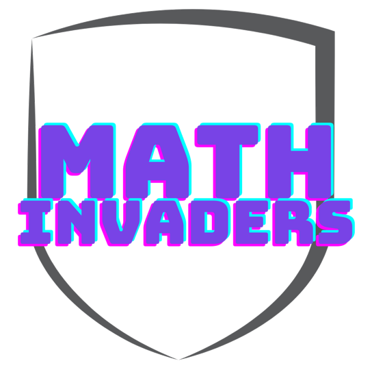

# Projet 2 : Math Invaders

## Cahier des charges

### Demandes

En vous inspirant de ce qui a été fait en TP avec le jeu Eisbär, vous devez créer par équipe de 2 ou de 3 maximum un jeu interactif simple à destination d’un enfant du CP-CE1 mettant en jeu ses compétences de lecture, calcul et de logique.
L’enfant pourra jouer via une page Web interactive ( html + css + JavaScript ) dans laquelle la partie dynamique comporte :
• des images libres de droits
• des entrées
• des boutons

### Description

Math Invaders est un jeu de type space invaders où il faut entrer le résultat de l'opération mathématique apparaissant sur les vaisseaux aliens arrivant en haut de l'écran. 
A la validation d'un résultat, un missile contenant le résultat entré est propulsé vers le vaisseau alien indiqué. 
Lors de l'impact, si le résultat est correct, le vaisseau alien disparaitra. Sinon, le missile n'aura aucun effet, et il faudra attendre 3 secondes avant de pouvoir relancer à nouveau un missile.
Au fur et à mesure de la partie, les vaisseaux aliens avancent plus vite et portent des opérations de plus en plus dures.
De temps en temps, des boss pourront apparaitre. Ils nécessitent la résolution de plusieurs opérations, mais sont plus lents.
La partie se termine lorsqu'un vaisseau alien parvient à toucher la ligne rouge. Le score de partie sera alors affiché.

### Solutions techniques

### Patch note
28/12/23 : Clément : (maison)
- Ajout d'une animation présentant le jeu sur l'écran des règles
- Ajout des images des ennemis et du boss
- Optimisation des vérifications de la boucle principale du jeu
- Alignement des composants du boss

28/12/23 : Maximilien : (maison)
- Ajout des spécification de certaines fonctions

28/12/23 : Julien : (maison)
- Création du vaisseau boss en pixel
- Ajout des règles dans la page d'accueil
- Correction de bug dans la page paramètre 
- Ajout de bouton pour régler la difficulté

27/12/23 : Maximilien : (maison)
- Ajout de fonctions servant au fonctionnement du boss (verification_boss, selection_boss, elimination_boss)
- Spécification de ces fonctions
- Ajustement de la position du boss et de ses opérations

27/12/23 : Julien : (maison)
- Embellissement de la page de jeu 
- Embellisement de la navigation 
- Ajout de vaisseau tombant dans la page d'accueil
- Commencement du réglage de la difficulté dans les paramètres

27/12/23 : Clément : (maison)
- Ajout des boss, apparaissant une fois toutes les cinq phases
- Ajout d'une limite variable de progression des vaisseaux ennemis
- Optimisation des variables
- Optimisation du changement de fenêtre
- Optimisation des sélecteurs CSS
- Correction des erreurs d'accessibilité HTML

26/12/23 : Clément : (maison)
- Correction du bug par lequel le jeu plantait lors du démarrage d'une deuxième partie
- Amélioration de la qualité de l'image du joueur

26/12/23 : Maximilien : (maison)
- Ajout d'une bannière faisant apparaitre le score du joueur
- Modification de fonctions existantes pour calculer le score du joueur
- Ajout d'une fonction ajustant le score obtenu par le joueur en fonction du temps mis à calculer une opération
- Correction d'un défaut laissant le score atteindre des valeurs négatives

26/12/23 : Julien : (maison)
- Ajout de l'image du vaisseau du joueur
- Création du vaisseau ennemi
- Embellisement de la page des règles du jeu
- Tableau créé dans la page des règles du jeu

25/12/23 : Clément : (maison)
- Optimisation des fonctions
- Correction du traitement des entrées utilisateur
- Ajout du système d'élimination des vaisseaux
- Ajout du système de phases de combat, la vitesse des vaisseaux ennemis augmente au fur et à mesure des phases

25/12/23 : julien : (maison)
- Création du vaisseau joueur pixel

25/12/23 : Maximilien : (maison)
- Ajout d'une fonction qui selectionne un vaisseau au hasard
- Ajout d'une fonction qui vérifie la réponse donnée par le joueur
- Ajout d'un détecteur pour activer la fonction précedente en appuyant sur la touche entrée
- Ajustement très léger des positions des vaisseaux

24/12/23 : Clément : (maison)
- Ajout des mouvements des vaisseaux
- Ajout d'un input pour entrer les résultats

21/12/23 : Maximilien : (cours)
- Ajout des alt pour les images pour une meilleure accessibilité

21/12/23 : Julien : (cours)
- mise en place de la structure d'accueil

15/12/23 : Clément : (maison)
- Mise en place des vaisseaux et de leur opération
- Réorganisation de l'esthétique de l'espace de jeu

13/12/23 : Clément : (maison)
- Création de la structure générale de l'espace de jeu
- Ajout d'un bouton commençant le jeu et faisant apparaitre les vaisseaux
- Ajout d'une fonction arrêtant le jeu automatiquement en raison de certaines actions utilisateur
- Ajout d'une dizaine de constantes et variables sélectionnant divers éléments
- Effet de survol des boutons de navigation

12/12/23 : Clément : (maison)
- Organisation de la fenêtre de jeu
- Embellissement de la barre de navigation

11/12/23 : Clément : (maison)
- Mise en service des boutons de navigation en les faisant cacher ou apparaitre des fenêtres

10/12/23 : Maximilien : (maison)
- Création d'un bouton qui fait apparaitre l'image du vaisseau ennemi, au mauvais endroits

08/12/23 : Clément : (maison)
- Création de la structure générale des fichiers
- Rédaction du cahier des charges
- Organisation des moyens de partage de code
- Implémentation du logo du projet
- Création de la structure générale du fichier HTML
- Mise en forme temporaire avec le fichier CSS
- Création des variables importantes dans le fichier JS

### Répartition du travail

##### Clément
- Structure générale des menus
- Mouvements des vaisseaux aliens
- Elimination des vaisseaux aliens
- Gestion des boss

##### Julien
- Présentation ludique du jeu
- Embellissement général avec CSS
- Design graphique
- Paramètres

##### Maximilien
- Génération des vaisseaux aliens
- Gestion des entrées utilisateur
- Gestion du score
